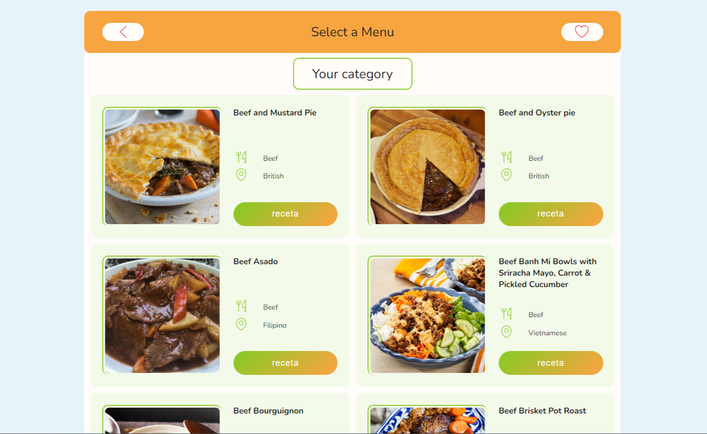
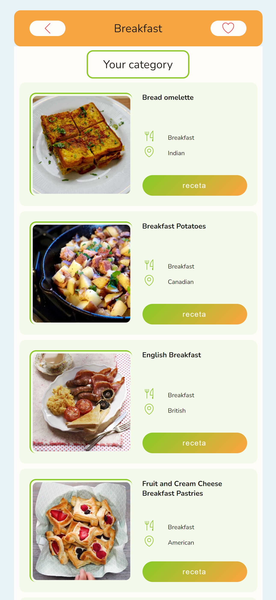
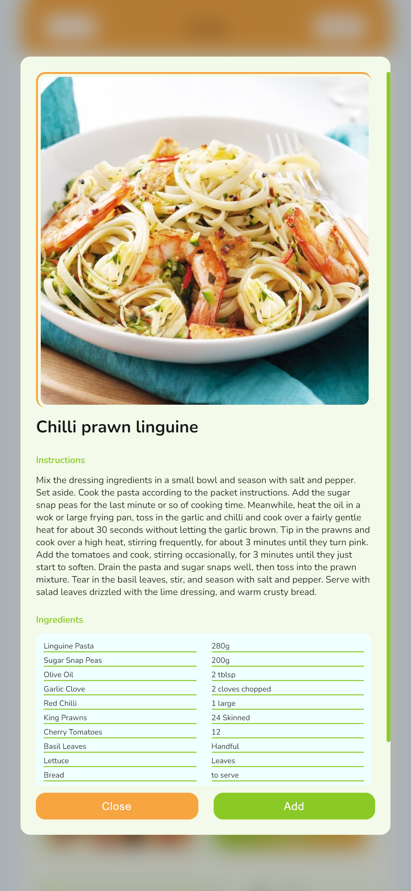

# 🍲 Recipe Finder Web App

## 🔭Overview

The Recipe Finder Web App is a delightful application that fetches recipes from
an API and categorizes them for easy browsing. Users can view recipe details,
including preparation steps and ingredients. Favorited recipes can be saved for
later viewing. The app features a fresh and vibrant design, with smooth
animations and responsive layouts for small devices.

## 🎖️Features

- **Fetch Recipes by Categories**: Retrieve and browse recipes divided into
  various categories.
- **Recipe Details**: View detailed instructions and ingredients for each
  recipe.
- **Favorites Page**: Save favorite recipes to a special page for easy access
  later.
- **Smooth Animations**: Enjoy a pleasant user experience with fresh and lively
  animations.
- **Responsive Design**: Optimized for both desktop and mobile devices.

## 💻Technologies Used

- :
  Vanilla JavaScript for application logic.
- :
  HTML for structuring the web pages.
- :
  Sass for styling the application with clean and maintainable CSS.
- :
  Figma for designing the user interface.

## 🚧Installation

To run the application locally:

1. Clone the repository to your local machine.
2. Navigate to the project directory.
3. Open the `index.html` file in your web browser.

## ⚙️Usage

1. Open the application in your web browser.
2. Browse recipes by selecting different categories.
3. View detailed instructions and ingredients for each recipe.
4. Save your favorite recipes to the "Favorites" page for easy access later.
5. Enjoy the fresh design and smooth animations!

## 🎬Live Demo

Check out the live version of the app [HERE🌟](https://yumbox-app.netlify.app/).

## 🎞️Screenshots

